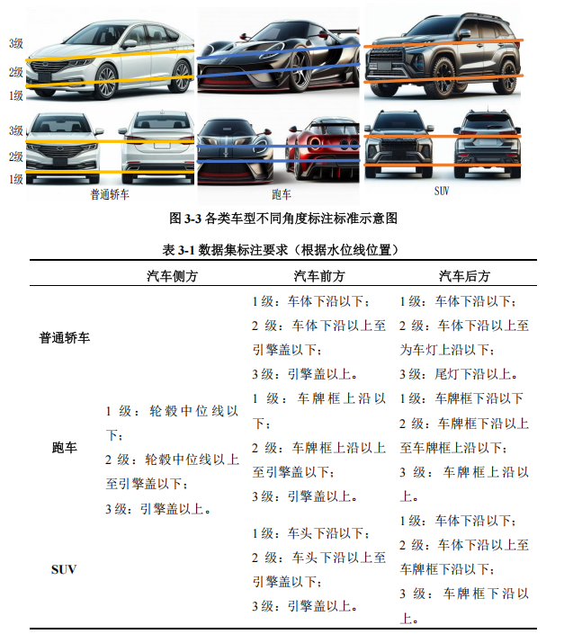
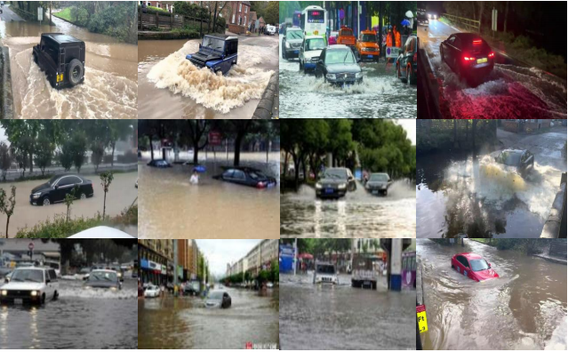

# ISE-UFDS: Urban Flooding Vehicle Detection Dataset

## 📖 简介

YQKJ-ISE-UFDS（Urban Flooding Vehicle Detection Dataset）是一个专为城市内涝场景下车辆检测与危险度评估任务构建的大规模图像数据集。该数据集包含 20,152 张图像，涵盖不同水位、车型、视角及天气条件，每张图像均提供精细的边界框标注与危险等级标签（安全、不安全、危险），数据来源YOUTUBE网站收集分割,由北京强强源起科技有限公司团队标定。

数据集旨在推动洪涝灾害场景下的计算机视觉研究，特别是在极端天气条件下的车辆检测、风险评估与应急救援系统中的算法开发与评估。

## 📊 数据集概览

- **图像数量**：20,152 张
- **标注格式**：YOLO 格式（txt）
- **标注内容**：
  - 车辆边界框（x_center, y_center, width, height）
  - 车辆类型（轿车、SUV、跑车等）
  - 危险等级（safe / unsafe / dangerous）
- **划分比例**：训练集 80% / 验证集 10% / 测试集 10%
- **图像分辨率**：统一调整为 640×640

## 分类标准：


## 数据示例


## 🚀 下载方式

数据集官网地址：https://www.yuanqi-tech.com/?shujuji.html
CSDN地址：
## 📌 引用

如果您使用了本数据集，请引用以下论文：

```bibtex
@inproceedings{sun2024ise,
  title={ISE-UFDS: A Dataset for Detecting the Degree of Danger to Vehicles in Urban Flooding and Performance Assessment},
  author={Sun, Jiwu and Zhang, Cheng and Xu, Cheng and Wang, Pengfei and Liu, Hongzhe},
  booktitle={International Conference on Intelligent Computing},
  pages={402--413},
  year={2024},
  organization={Springer}
}

@article{sun2025flood,
  title={Flood scenarios vehicle detection algorithm based on improved YOLOv9},
  author={Sun, Jiwu and Xu, Cheng and Zhang, Cheng and Zheng, Yujia and Wang, Pengfei and Liu, Hongzhe},
  journal={Multimedia Systems},
  volume={31},
  number={2},
  pages={74},
  year={2025},
  publisher={Springer}
}

📮 联系我们
如有任何问题或建议，欢迎通过以下方式联系：

邮箱：qiangqiangyuanqi@126.com
GitHub Issue：提交问题或建议
📜 许可证
本数据集仅限研究使用，禁止用于商业用途。使用时请遵守相关法律法规并注明数据来源。